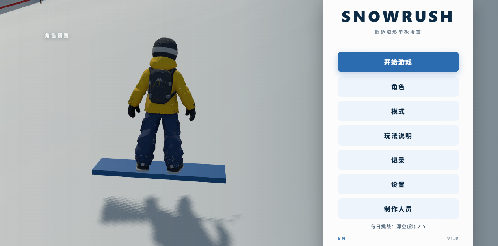
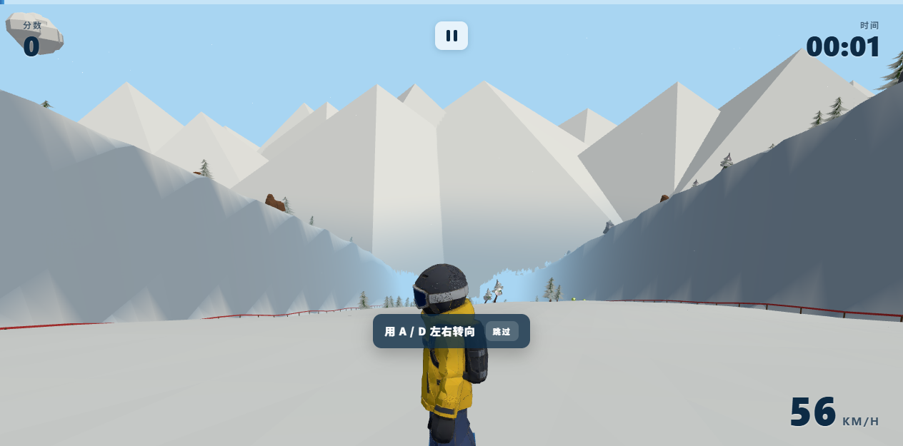
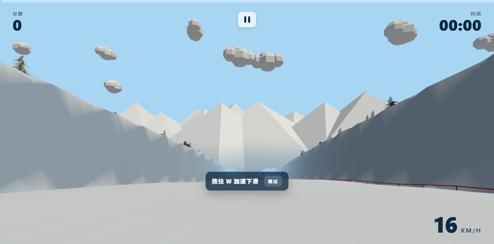

# SnowRush


[](https://xingyezn.github.io/SnowRush/)

**SnowRush** 是一款运行在浏览器里的第三人称 **Low-poly 街机单板滑雪游戏**。

无需安装、无需注册，打开网页即可从雪山之巅一路滑下：转向、加速、刹车、起跳，
在空中完成前后空翻与转体，落得漂亮还能连招加分，最终冲过终点。

### ▶ 在线试玩

**https://xingyezn.github.io/SnowRush/**

> 建议使用桌面版 Chrome / Edge（需要键盘操作）。

### 截图

| 开始菜单 | 滑行（第三人称） | 第一人称 |
|---|---|---|
|  |  |  |

---

## 玩法特色

- **街机滑雪手感**：弧线 Carving 转向、下坡加速、刹车；镜头贴近角色，高速时也能看清动作。
- **跳跃与空中特技**：Frontflip、Backflip、Double、360、720、1080，以及各种组合连招。
- **落地判定与连击**：根据落地角度判定安全 / 勉强 / 摔车，连续成功特技 Combo 倍率越高。
- **完整赛道流程**：7 段赛道（热身 / 树林 / 旗门 / 跳台 / 高速 / 大跳台 / 终点）、存档点、计时与成绩单。
- **可玩角色**：多名角色可选，开始菜单即可预览、旋转查看。
- **四季雪景**：雪顶远山、两侧悬崖、飘雪、雪痕、落地雪爆与天空云朵。
- **程序化音频**：风声、滑行声、跳跃、落地、摔车等随速度变化，菜单/游戏两套 BGM 与 UI 音效全部由 Web Audio 合成，无需下载音频资源；支持主音量 / 音乐 / 音效分轨与静音（M 键）。
- **中文 / English**：界面默认中文，可一键切换英文。
- **标准游戏外壳**：带进度条的加载界面、主菜单（开始 / 角色 / 玩法说明 / 记录 / 设置 / 制作人员）、键盘导航、设置（主音量 / 音乐 / 音效 / 静音 / 阴影）、结算评级与 NEW BEST、赛道进度条。
- **记录与成就**：生涯最高分 / 最快用时 / 最高速度 / 最高连击等统计数据，以及 11 个可解锁成就，结算时提示破纪录项与解锁成就。
- **首次教学**：第一次滑行会有分步提示（加速 / 转向 / 跳跃 / 旗门），可随时跳过；设置中可开关。
- **适配与无障碍**：窄屏自适应布局、触屏设备提示、键盘焦点导航，并尊重系统的「减少动态效果」设置。
- **性能友好**：画质（自动 / 高 / 低）可调，自动档会根据帧率动态调整；可选 FPS 显示；切到后台时自动暂停。
- **游玩模式**：标准 / 计时挑战 / 一命通关，主菜单可切换。
- **每日挑战**：每天轮换一个目标（得分 / 旗门 / 特技 / 速度 / 用时 / 滞空），达成有提示。
- **拍照模式**：按 `K` 隐藏界面、自由环绕缩放并保存截图。
- **双视角**：第三人称（默认，镜头拉近、动作清晰）与第一人称（按 `V` 切换），设置中可切换并记忆。

---

## 操作方式

### 地面

| 按键 | 功能 |
|---|---|
| W / ↑ | 加速 |
| S / ↓ | 刹车 |
| A / ← | 左转 |
| D / → | 右转 |
| Space | 跳跃 |
| R | 回到最近存档点 |
| V | 切换第一 / 第三人称 |
| K | 拍照模式 |
| M | 静音 |
| P / ESC | 暂停 |

### 空中

| 按键 | 功能 |
|---|---|
| W | 前空翻（Frontflip） |
| S | 后空翻（Backflip） |
| A / D | 转体（Spin） |

---

## 技术栈

- [Vite](https://vitejs.dev/) + [TypeScript](https://www.typescriptlang.org/)
- [Three.js](https://threejs.org/)（渲染）
- [Rapier](https://rapier.rs/)（物理）
- 纯 HTML / CSS 界面

---

## 本地运行

```bash
npm install
npm run dev       # 打开 http://localhost:5173/
```

打包与预览：

```bash
npm run build
npm run preview   # 打开 http://localhost:4173/
```

---

## 开发文档

- [`docs/ASSET_PIPELINE.md`](docs/ASSET_PIPELINE.md)：**如何压缩大模型**（Blender 减面 + 贴图压缩）、自动绑定骨骼动画、接入游戏与重新生成截图
- [`ARCHITECTURE.md`](ARCHITECTURE.md)：技术架构与模块边界
- [`TASKS.md`](TASKS.md)：分阶段任务与进度
- [`PRODUCT_SPEC.md`](PRODUCT_SPEC.md)：产品与玩法规范

---

## 许可

本项目基于 [MIT License](LICENSE) 发布。所用第三方模型见
[`public/models/LICENSE.txt`](public/models/LICENSE.txt)。
