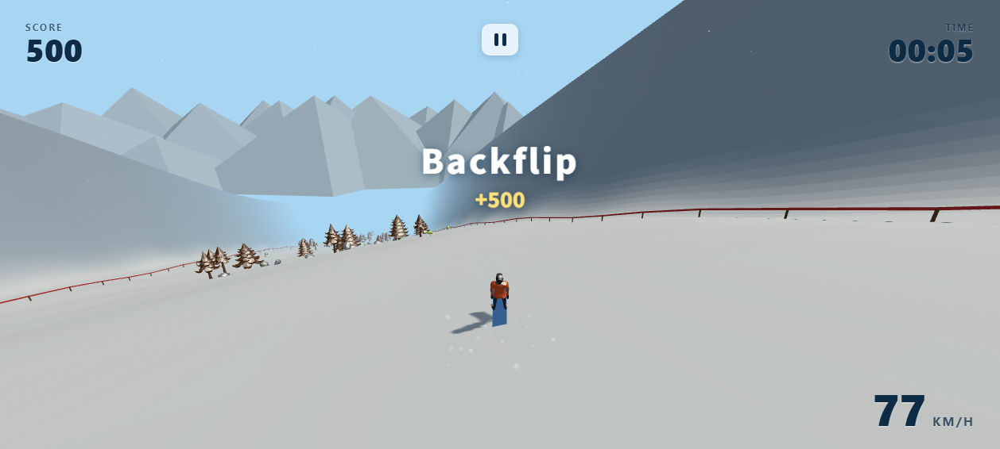

# SnowRush


[](https://xingyezn.github.io/SnowRush/)

**SnowRush** 是一款运行在浏览器里的第三人称 **Low-poly 街机单板滑雪游戏**。

无需安装、无需注册，打开网页即可从雪山之巅一路滑下：转向、加速、刹车、起跳，
在空中完成前后空翻与转体，落得漂亮还能连招加分，最终冲过终点。

### ▶ 在线试玩

**https://xingyezn.github.io/SnowRush/**

> 建议使用桌面版 Chrome / Edge（需要键盘操作）。

### 截图

| 开始菜单 | 滑行 | 空中特技 |
|---|---|---|
|  |  |  |

---

## 玩法特色

- **街机滑雪手感**：弧线 Carving 转向、下坡加速、刹车，速度越快镜头越远、视角越广。
- **跳跃与空中特技**：Frontflip、Backflip、Double、360、720、1080，以及各种组合连招。
- **落地判定与连击**：根据落地角度判定安全 / 勉强 / 摔车，连续成功特技 Combo 倍率越高。
- **完整赛道流程**：7 段赛道（热身 / 树林 / 旗门 / 跳台 / 高速 / 大跳台 / 终点）、检查点、计时与成绩单。
- **可玩角色**：多名角色可选，开始菜单即可预览、旋转查看。
- **四季雪景**：雪顶远山、两侧悬崖、飘雪、雪痕、落地雪爆与天空云朵。
- **程序化音效**：风声、滑行声、跳跃、落地、摔车等随速度变化，无需下载音频资源。
- **中文 / English**：界面默认中文，可一键切换英文。

---

## 操作方式

### 地面

| 按键 | 功能 |
|---|---|
| W / ↑ | 加速 |
| S / ↓ | 刹车 |
| A / ← | 左转 |
| D / → | 右转 |
| Space | 跳跃 |
| R | 回到最近检查点 |
| P / ESC | 暂停 |

### 空中

| 按键 | 功能 |
|---|---|
| W | 前空翻（Frontflip） |
| S | 后空翻（Backflip） |
| A / D | 转体（Spin） |

---

## 技术栈

- [Vite](https://vitejs.dev/) + [TypeScript](https://www.typescriptlang.org/)
- [Three.js](https://threejs.org/)（渲染）
- [Rapier](https://rapier.rs/)（物理）
- 纯 HTML / CSS 界面

---

## 本地运行

```bash
npm install
npm run dev       # 打开 http://localhost:5173/
```

打包与预览：

```bash
npm run build
npm run preview   # 打开 http://localhost:4173/
```

---

## 许可

本项目基于 [MIT License](LICENSE) 发布。所用第三方模型见
[`public/models/LICENSE.txt`](public/models/LICENSE.txt)。
